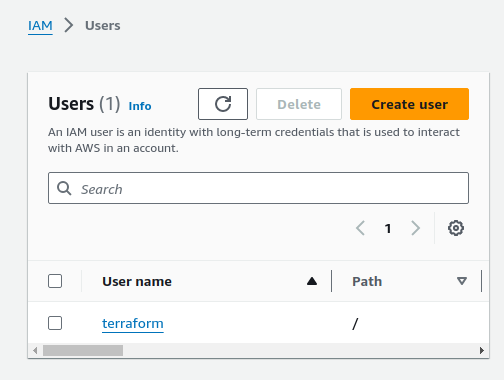
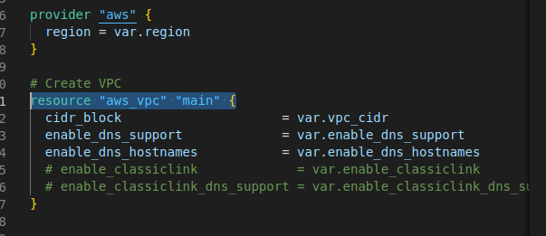

-   create an IAM user, name it terraform. give it only programatic access to AWS and grant AdministratorAccess permissions.
-   copy the secret access key and access key ID. COnfigure programmatic access from workstation to connect to AWS using the keys copied.



-   create an S3 bucket to store Terraform state file


## VPC | Subnets | Security Groups
-   create a folder called PBL
-   create a file in the folder called main.tf
-   add AWS as a provider and a resource to create a VPC in the main.tf file
```
provider "aws" {
  region = "eu-central-1"
}

# Create VPC
resource "aws_vpc" "main" {
  cidr_block                     = "172.16.0.0/16"
  enable_dns_support             = "true"
  enable_dns_hostnames           = "true"
  enable_classiclink             = "false"
  enable_classiclink_dns_support = "false"
}
```


- run `terraform init` command


-   run `terraform plan` to see what we are about to create
-   run `terraform apply` if satisfied with the plan